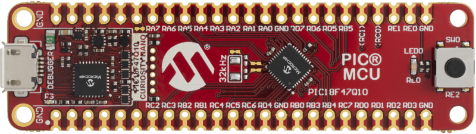
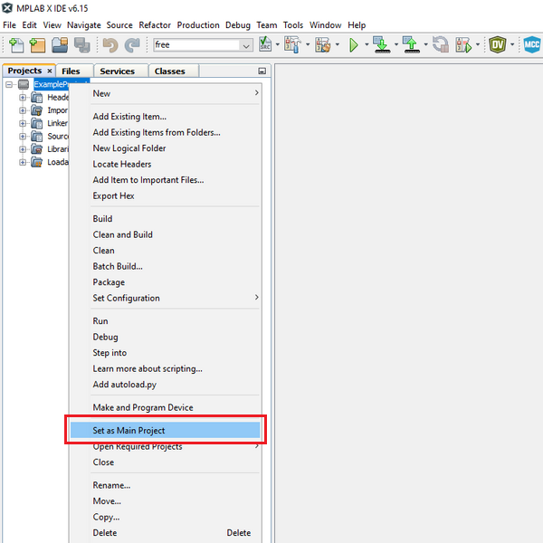
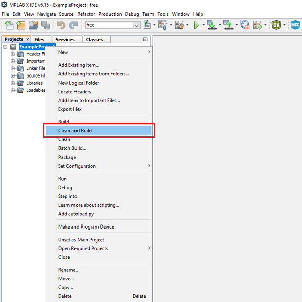
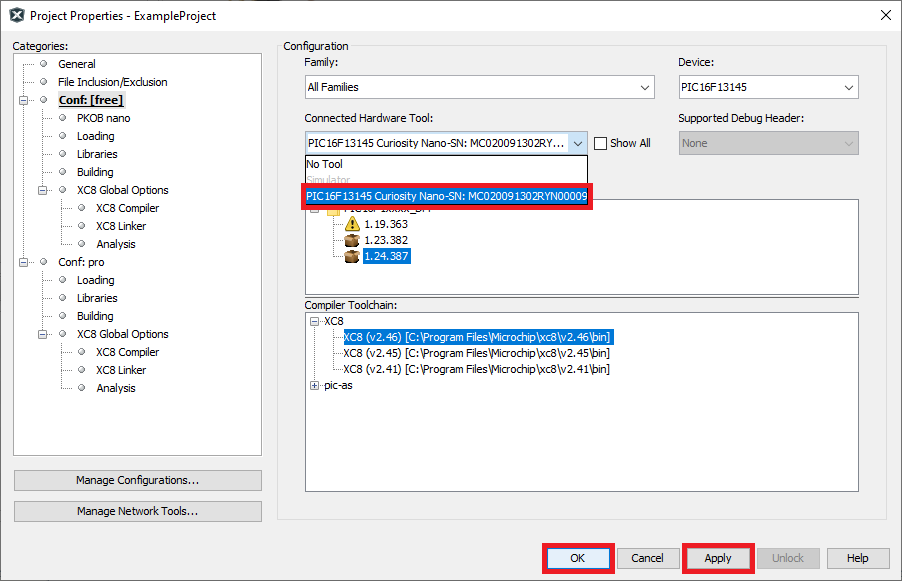
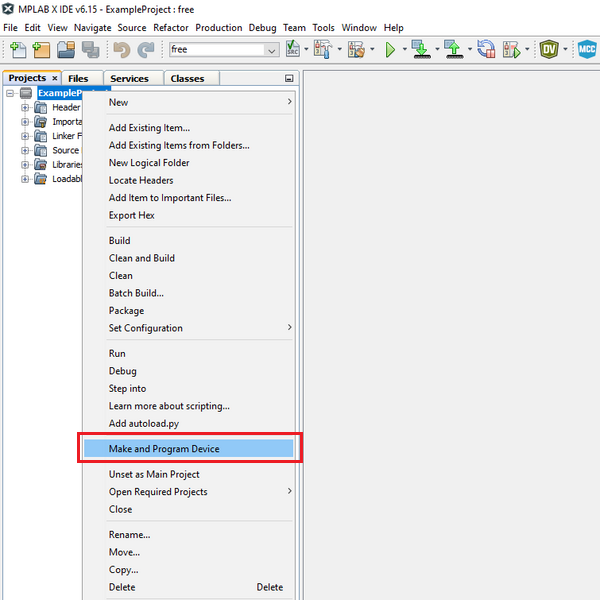

<a href="https://www.microchip.com">
    <picture>
        <source media="(prefers-color-scheme: light)" srcset="images/microchip-light.png">
        <source media="(prefers-color-scheme: dark)" srcset="images/microchip-dark.png">
        
    </picture>
</a>

# Receive Control Commands via EUSART Using the PIC18F47Q10 Microcontroller

This example shows how to implement a command line interface, enabling the microcontroller (MCU) to receive control commands via the Enhanced Universal Synchronous Asynchronous Receiver Transmitter (EUSART). In this use case, an LED is controlled using commands sent from the MPLAB® Data Visualizer.

## Related Documentation

- [TB3282 – Getting Started With UART Using EUSART on PIC18](https://www.microchip.com/en-us/application-notes/tb3282?utm_source=GitHub&utm_medium=TextLink&utm_campaign=MCU8_PIC18-Q10&utm_content=pic18f47q10-cnano-eusart-commands-bare-github&utm_bu=MCU08)
- [PIC18-Q10 Product Family](https://www.microchip.com/en-us/products/microcontrollers-and-microprocessors/8-bit-mcus/pic-mcus/pic18f-q10?utm_source=GitHub&utm_medium=TextLink&utm_campaign=MCU8_PIC18-Q10&utm_content=pic18f47q10-cnano-eusart-commands-bare-github&utm_bu=MCU08)
- [PIC18F47Q10 Product Page](https://www.microchip.com/en-us/product/PIC18F47Q10?utm_source=GitHub&utm_medium=TextLink&utm_campaign=MCU8_PIC18-Q10&utm_content=pic18f47q10-cnano-eusart-commands-bare-github&utm_bu=MCU08)
- [PIC18F47Q10 Data Sheet](https://ww1.microchip.com/downloads/aemDocuments/documents/MCU08/ProductDocuments/DataSheets/PIC18F27-47Q10-Micorcontroller-Data-Sheet-DS40002043.pdf?utm_source=GitHub&utm_medium=TextLink&utm_campaign=MCU8_PIC18-Q10&utm_content=pic18f47q10-cnano-eusart-commands-bare-github&utm_bu=MCU08)
- [PIC18F47Q10 Curiosity Nano](https://www.microchip.com/en-us/development-tool/DM182029?utm_source=GitHub&utm_medium=TextLink&utm_campaign=MCU8_PIC18-Q10&utm_content=pic18f47q10-cnano-eusart-commands-bare-github&utm_bu=MCU08)
- [PIC18F47Q10 Code Examples on GitHub](https://github.com/orgs/microchip-pic-avr-examples/repositories?q=pic18f47q10&type=all)

## Software Used

- [MPLAB® X IDE v6.20 or newer](https://www.microchip.com/en-us/tools-resources/develop/mplab-x-ide?utm_source=GitHub&utm_medium=TextLink&utm_campaign=MCU8_PIC18-Q10&utm_content=pic18f47q10-cnano-eusart-commands-bare-github&utm_bu=MCU08)
- [MPLAB XC8 v2.46 or newer](https://www.microchip.com/en-us/tools-resources/develop/mplab-xc-compilers?utm_source=GitHub&utm_medium=TextLink&utm_campaign=MCU8_PIC18-Q10&utm_content=pic18f47q10-cnano-eusart-commands-bare-github&utm_bu=MCU08)
- [PIC18F-Q_DFP 1.25.433](https://packs.download.microchip.com/)

## Hardware Used

- The [PIC18F47Q10 Curiosity Nano](https://www.microchip.com/en-us/development-tool/DM182029?utm_source=GitHub&utm_medium=TextLink&utm_campaign=MCU8_PIC18-Q10&utm_content=pic18f47q10-cnano-eusart-commands-bare-github&utm_bu=MCU08) development board is used as a test platform:

    

## Setup

The [PIC18F47Q10 Curiosity Nano](https://www.microchip.com/en-us/development-tool/DM182029?utm_source=GitHub&utm_medium=TextLink&utm_campaign=MCU8_PIC18-Q10&utm_content=pic18f47q10-cnano-eusart-commands-bare-github&utm_bu=MCU08) development board has an on-board debugger that acts as an USART-to-USB convertor so no further hardware is needed.

The following configurations must be made for this project:

| Pin                | Configuration  |
| :----------------- | :------------- |
| RD0 (EUSART2 - TX) | Digital output |
| RD1 (EUSART2 - RX) | Digital input  |
| RE0 (LED0)         | Digital output |

## Demo

Run the code and configure the Data Visualizer as described in the referenced technical brief document. Type commands to be sent to the board. The two available commands are "ON" and "OFF". Observe the LED on the board as it changes its state according to the command sent. It is convenient to use the line terminator as command delimiter, so for this use case, EUSART will read full lines and then check if the line contains a valid command.

## Summary

This demo showcases how EUSART can be used to implement a command line interface, allowing the MCU to receive commands via EUSART.

## How to Program the Curiosity Nano board

This chapter shows how to use the MPLAB X IDE to program a PIC® device with an `ExampleProject.X`. This can be applied to any other projects.

1. Connect the board to the computer.

2. Open the `ExampleProject.X` project in MPLAB X IDE.

3. Set the ExampleProject project as main project.

    Right click the project in the **Projects** tab and click Set as Main Project.

    

4. Clean and build the ExampleProject project.

    Right click the ExampleProject project and select Clean and Build.

    

5. Select the PIC Curiosity Nano in the Connected Hardware Tool section of the project settings:

    - Right click the project and click Properties
    - Click the arrow under the Connected Hardware Tool
    - Select the PIC Curiosity Nano, click **Apply** and then click **OK**:

    

6. Program the project to the board.

    Right click the project and click Make and Program Device.

    

## Contents

- [Back to Related Documentation](#related-documentation)
- [Back to Software Used](#software-used)
- [Back to Hardware Used](#hardware-used)
- [Back to Setup](#setup)
- [Back to Demo](#demo)
- [Back to Summary](#summary)
- [Back to How to Program the Curiosity Nano board](#how-to-program-the-curiosity-nano-board)
- [Back to Top](#receive-control-commands-via-eusart-using-the-pic18f47q10-microcontroller)
