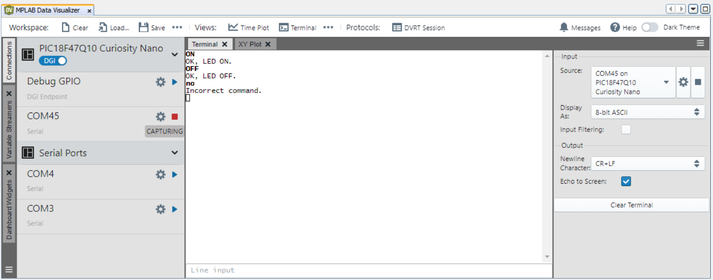

# PIC18F47Q10 EUSART Receive Control Commands

This example shows how to implement a command line interface. This way, the microcontroller can receive
control commands via the EUSART. In this use case, an LED is controlled using commands sent from the
MPLAB Data Visualizer..

## Related Documentation

- [Getting Started with UART using EUSART on PIC18](https://microchip.com/)
- [PIC18F-Q10 Family Product Page](https://www.microchip.com/design-centers/8-bit/pic-mcus/device-selection/pic18f-q10-product-family)

## Software Used

- MPLAB® X IDE 5.30 or newer [(microchip.com/mplab/mplab-x-ide)](http://www.microchip.com/mplab/mplab-x-ide)
- MPLAB® XC8 2.10 or a newer compiler [(microchip.com/mplab/compilers)](http://www.microchip.com/mplab/compilers)
- MPLAB® Code Configurator (MCC) 3.95.0 or newer [(microchip.com/mplab/mplab-code-configurator)](https://www.microchip.com/mplab/mplab-code-configurator)
- MPLAB® Code Configurator (MCC) Device Libraries PIC10 / PIC12 / PIC16 / PIC18 MCUs [(microchip.com/mplab/mplab-code-configurator)](https://www.microchip.com/mplab/mplab-code-configurator)
- Microchip PIC18F-Q Series Device Support (1.4.109) or newer [(packs.download.microchip.com/)](https://packs.download.microchip.com/)

## Hardware Used

- PIC18F47Q10 Curiosity Nano [(DM182029)](https://www.microchip.com/Developmenttools/ProductDetails/DM182029)

## Setup

The PIC18F47Q10 Curiosity Nano Development Board [(DM182029)](https://www.microchip.com/Developmenttools/ProductDetails/DM182029) is used as the test platform. It has an onboard debugger that acts as an USART to USB convertor so no further hardware is needed.

The following configurations must be made for this project:

| Pin | Configuration  |
| :-: | :------------: |
| RD0 | Digital Output |
| RD1 | Digital Input  |
| RE0 | Digital Output |

## Operation

Run the code and configure the Data Visualizer as described in the Technical Brief document. Type commands to be sent to the board. The two available commands are "ON" and "OFF". Observe the LED on the board as it changes its state
according to the command sent.

## Summary

One important usage of the EUSART represents the implementation of a command line interface. This way, the
microcontroller can receive control commands via EUSART. It is convenient to use the line terminator as command
delimiter, so for this use case, EUSART will read full lines and then check if the line contains a valid command.
